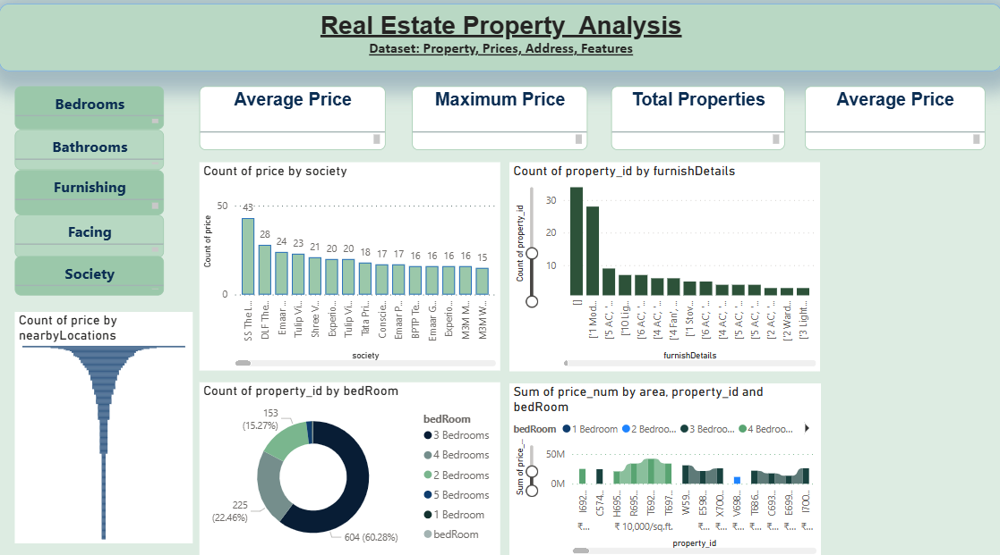

# 🏠 Real Estate Property Analysis

This project provides a **data analysis of real estate properties** using **Power BI**, focusing on property prices, sizes, locations, and features. The dashboard offers insights into property trends, average pricing, and distribution of features like bedrooms, bathrooms, and furnishing details.



---

## 📊 Dashboard Features

### 🔹 Filters Panel

* **Bedrooms**
* **Bathrooms**
* **Furnishing**
* **Facing**
* **Society**

### 🔹 KPIs (Cards on Top)

* **Average Price**
* **Maximum Price**
* **Total Properties**
* **Average Price (Dynamic by filters)**

### 🔹 Visualizations

* **Count of Price by Society** → Compare property counts across different societies.
* **Count of Property by Furnish Details** → Understand furnishing preferences (semi-furnished, fully furnished, etc.).
* **Count of Property by Bedrooms** → Distribution of 1BHK, 2BHK, 3BHK, and 4BHK.
* **Price Distribution by Nearby Locations** → Location-wise property pricing trends.
* **Sum of Price by Area & Bedrooms** → Relationship between area, number of bedrooms, and total property price.

---

## 📂 Dataset Information

* **Dataset Name:** `Property, Prices, Address, Features`
* **Attributes Include:**

  * Price
  * Bedrooms
  * Bathrooms
  * Furnishing Details
  * Facing
  * Society Name
  * Nearby Locations
  * Property Area

---

## 🚀 Technologies Used

* **Power BI** – Data Visualization
* **Python (optional, preprocessing)**
* **Excel/CSV** – Data Source

---

## 📸 Dashboard Preview

Here’s a snapshot of the Power BI dashboard:


---

## 🔧 How to Use

1. Clone the repository:

   ```bash
   git clone https://github.com/AnanyaSinghBabu/Real_Estate-Data-Analysis.git
   ```
2. Open the `.pbix` file in **Power BI Desktop**.
3. Explore the filters and visuals to analyze property insights.

---

## 🎯 Insights

* Most properties belong to **3 BHK category** (\~60%).
* Certain societies like **SS The L… and DLF…** have the highest property listings.
* Furnishing trends show **modular kitchen and semi-furnished** as the most common.
* Price variations are significantly influenced by **location and number of bedrooms**.

---

## 📌 Future Enhancements

* Add **predictive modeling** using Python (Price Prediction).
* Integrate **real-time property data** via APIs.
* Build an interactive **web dashboard** using Streamlit/Plotly.

---

## 👤 Author

**Ananya Singh Babu**
📌 Data Analyst | Power BI | SQL | Python

🔗 [GitHub Repository](https://github.com/AnanyaSinghBabu/Real_Estate-Data-Analysis)
